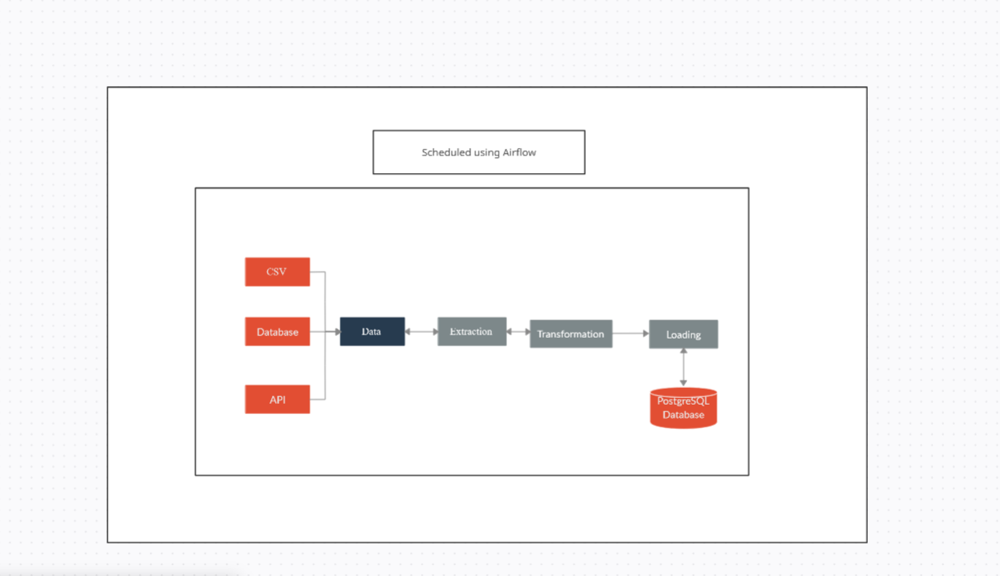

# ETL Architecture

## Architecture Diagram

*Figure 1: High-Level ETL Architecture Diagram*

## Components

### 1. Data Sources

- **Types:** CSV files, APIs, Databases
- **Description:** Data is extracted from multiple sources, including databases, flat files, and external APIs.

### 2. Extraction Layer

- **Technology:**  Python
- **Description:** The extraction layer pulls data from csv files (assuming csv files as source)
### 3. Transformation Layer

- **Technology:**  Pandas
- **Description:** The transformation layer performs upsert and append operations according to requirements

### 4. Load Layer

- **Technology:** PostgreSQL
- **Description:** The processed data is loaded into a target database or data warehouse where it can be queried and analyzed.

## Data Flow

The ETL process follows these steps:

1. **Extraction:** Data is extracted from the source systems.
2. **Transformation:** The extracted data undergoes cleaning, and transformation.
3. **Loading:** The transformed data is loaded into the target database
